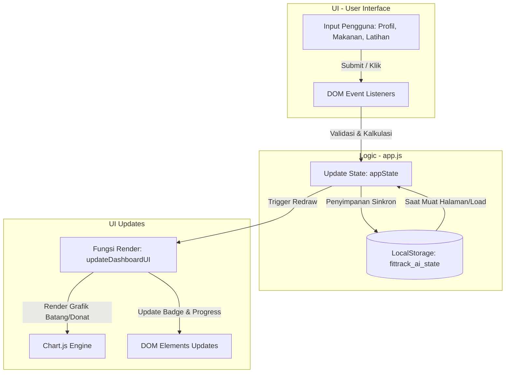

# FitTrack AI - Technical Documentation

FitTrack AI adalah aplikasi pelacak kebugaran dan nutrisi berbasis web yang berjalan sepenuhnya di sisi klien (offline-first). Aplikasi ini didesain menggunakan **Semantic HTML5**, **Vanilla CSS** dengan sistem warna Catppuccin Mocha, dan **Vanilla JavaScript** untuk seluruh logika bisnis dan manajemen status aplikasi.

---

## 1. Struktur Proyek

Repositori ini memiliki struktur file statis yang sangat teratur dan modular:

```text
healthy-web/
├── Product Requirement Document (PRD).md  # Dokumen spesifikasi kebutuhan aplikasi
├── README.md                              # Dokumentasi teknis sistem (file ini)
├── index.html                             # Layout antarmuka, modal, dan elemen SVG
├── index.css                              # Sistem desain, variabel warna Catppuccin, navigasi, dan animasi
└── app.js                                 # State management, event handling, kalkulasi, & grafik (Chart.js)
```

---

## 2. Arsitektur Data (LocalStorage State Schema)

Seluruh data pengguna disimpan secara lokal di browser melalui API `LocalStorage` dengan kunci `'fittrack_ai_state'`. Berikut adalah detail skema JSON yang digunakan dalam manajemen state (`appState`):

```json
{
  "activeTab": "dashboard",
  "profile": {
    "gender": "male",
    "age": 28,
    "weight": 70,
    "height": 175,
    "activityLevel": "active",
    "bmr": 1658,
    "tdee": 2570,
    "targetCalories": 2300,
    "targetProtein": 140,
    "defaultRestDuration": 90,
    "isSet": true
  },
  "foodLogs": [
    {
      "id": "food_1719124800000",
      "date": "2026-06-23",
      "name": "Nasi Goreng + Telur Ceplok",
      "portion": 250,
      "calories": 450,
      "protein": 18,
      "carbs": 55,
      "fat": 14,
      "timestamp": 1719124800000
    }
  ],
  "workoutLogs": [
    {
      "id": "workout_1719124900000",
      "date": "2026-06-23",
      "dayIndex": 1,
      "exercises": {
        "tuckFLHold": "15s, 15s, 12s",
        "dipsMaxReps": "12, 10, 8",
        "runDistance": 5.0,
        "runTimeSeconds": 1500,
        "runPaceMinutes": "5:00",
        "plankHold": "120s, 90s",
        "scapulaHangs": "30s",
        "legRaises": "15, 12, 12"
      }
    }
  ],
  "activeWorkoutDay": 1,
  "simMode": "presets",
  "selectedPresetMeal": null,
  "uploadedImageSrc": null,
  "timer": {
    "isRunning": false,
    "startTime": 0,
    "elapsedTime": 0,
    "timerInterval": null
  }
}
```

---

## 3. Alur Siklus Data (Data Flow Cycle)

Aplikasi ini menggunakan siklus data satu arah (unidirectional data flow) yang diinisiasi oleh aksi pengguna di antarmuka (UI). Alur proses tersebut digambarkan dalam diagram berikut:



---

## 4. Fungsi & Alur JavaScript Utama (`app.js`)

Aplikasi dikoordinasikan melalui beberapa fungsi utama di dalam `app.js`:

### A. Manajemen Inisialisasi & Router
- `loadStateFromLocalStorage()`: Berfungsi membaca `'fittrack_ai_state'` dari LocalStorage saat halaman dimuat pertama kali. Jika data kosong, aplikasi menginisialisasi dengan data default kosong.
- `switchTab(tabId)`: Mengontrol navigasi antar-panel tab (`dashboard`, `nutrition`, `workout`, `analytics`, `settings`) dengan menampilkan/menyembunyikan panel DOM dan menandai link navigasi yang aktif.

### B. Kalkulasi Metabolisme & Kalori
- `calculateBMR(gender, age, weight, height)`: Menghitung Angka Metabolisme Basal (BMR) menggunakan rumus Harris-Benedict yang direvisi.
- `calculateTDEE(bmr, activityLevel)`: Mengalikan BMR dengan faktor aktivitas fisik harian untuk mendapatkan estimasi total pembakaran energi (TDEE).

### C. Pelacakan Streak Harian
- Logika streak menghitung log harian unik dari `foodLogs` dan `workoutLogs` secara dinamis, mengevaluasi tanggal pengerjaan yang berurutan, dan memunculkan streak badge di header jika pengguna aktif beruntun dalam beberapa hari terakhir.

### D. Integrasi Visualisasi Grafik (Chart.js)
- `renderAnalyticsCharts()`: Mengambil log dari `foodLogs` dan `workoutLogs` untuk memvisualisasikan tren mingguan/bulanan, menggunakan gradien warna neon (Mauve, Lavender, dll.) yang disesuaikan secara visual agar kontras dengan latar belakang gelap.

---

## 5. Pengembangan & Penggunaan Lokal

Karena FitTrack AI dibangun murni tanpa framework backend (serverless statis), Anda dapat menjalankannya dengan mudah:

1. **Buka Langsung**: Cukup buka file `index.html` menggunakan browser Anda secara langsung (klik dua kali pada file).
2. **Server Lokal (Direkomendasikan)**: Untuk performa gambar statis dan transisi API lokal yang mulus, gunakan server statis sederhana:
   ```bash
   # Menggunakan Python 3
   python3 -m http.server 8000
   
   # Atau menggunakan Node.js (npx)
   npx serve .
   ```
3. Akses aplikasi melalui tautan `http://localhost:8000` atau `http://localhost:3000` di peramban web Anda.
